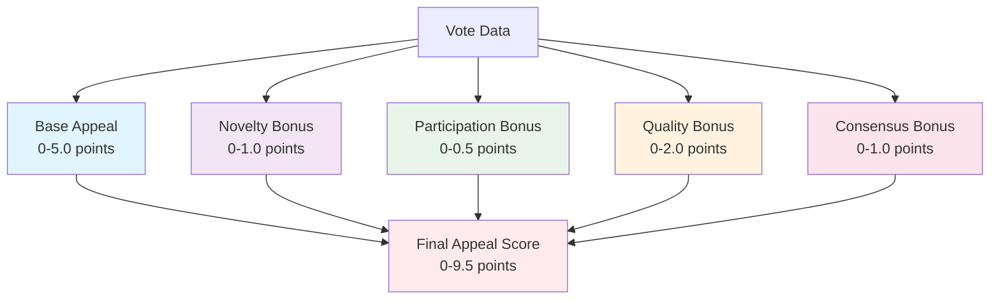
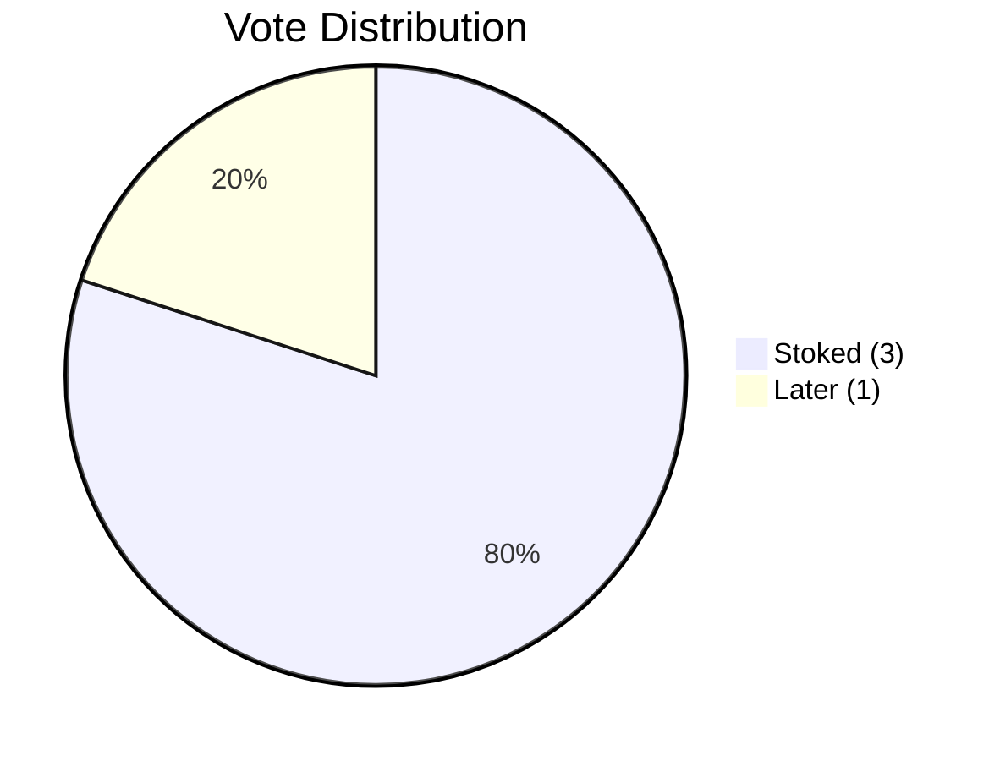
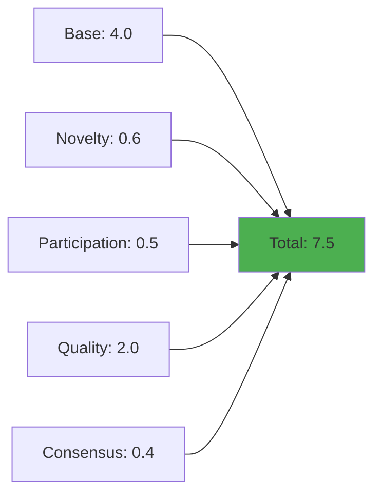
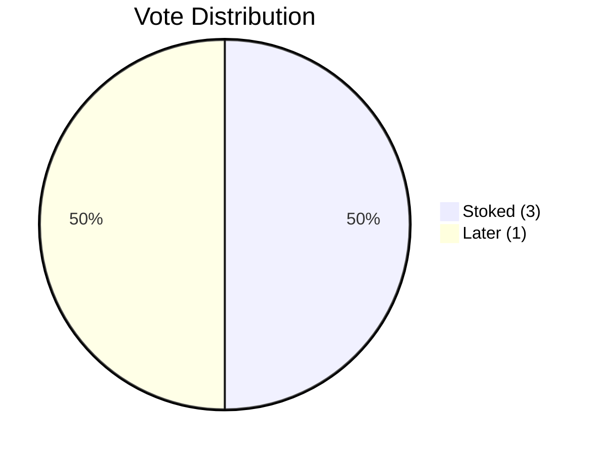
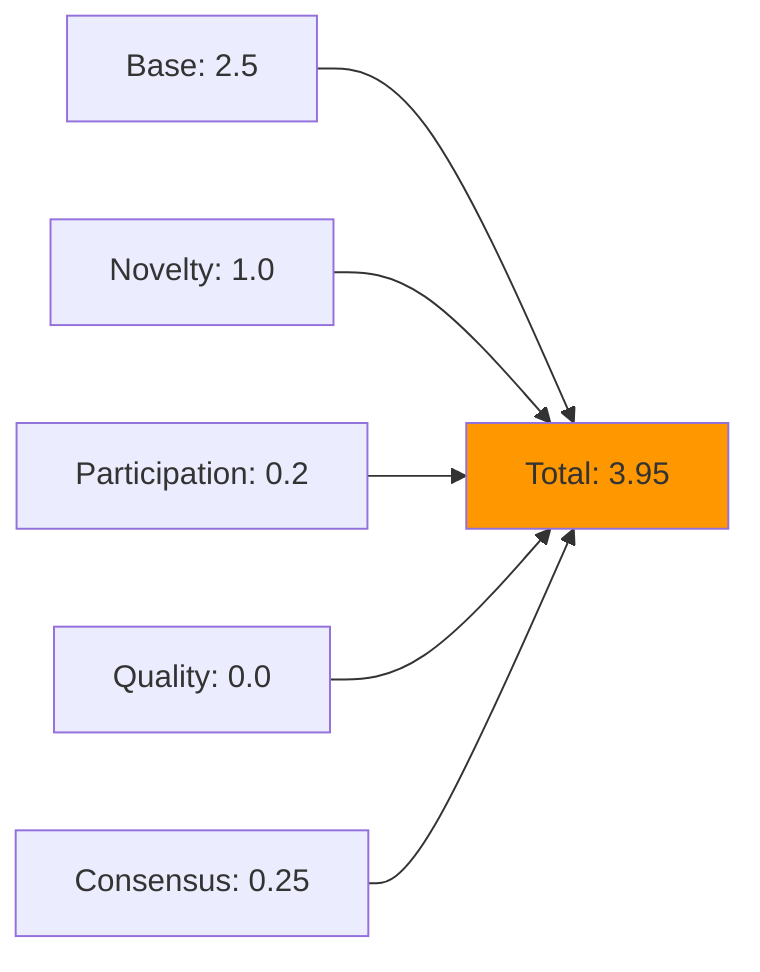
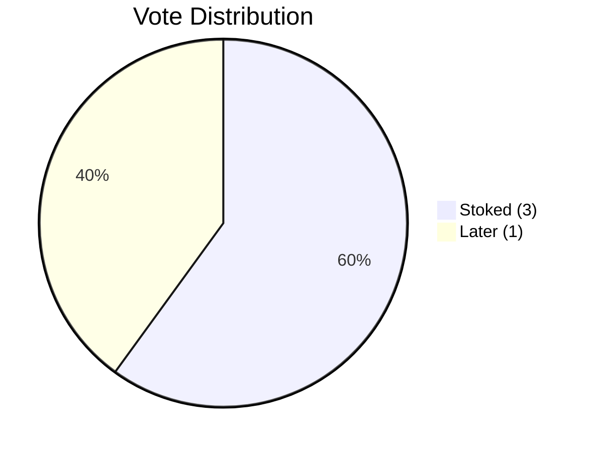
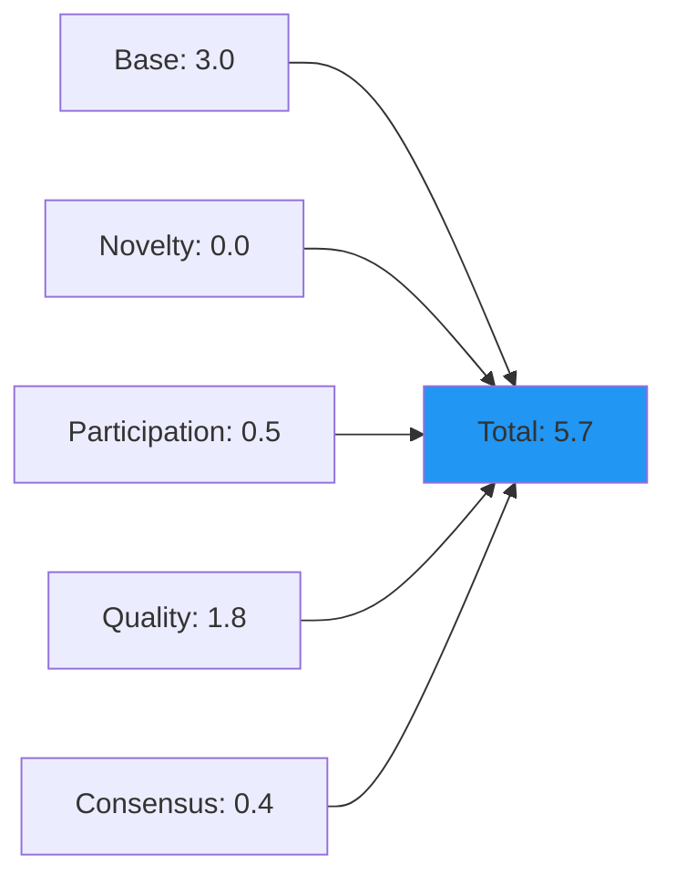
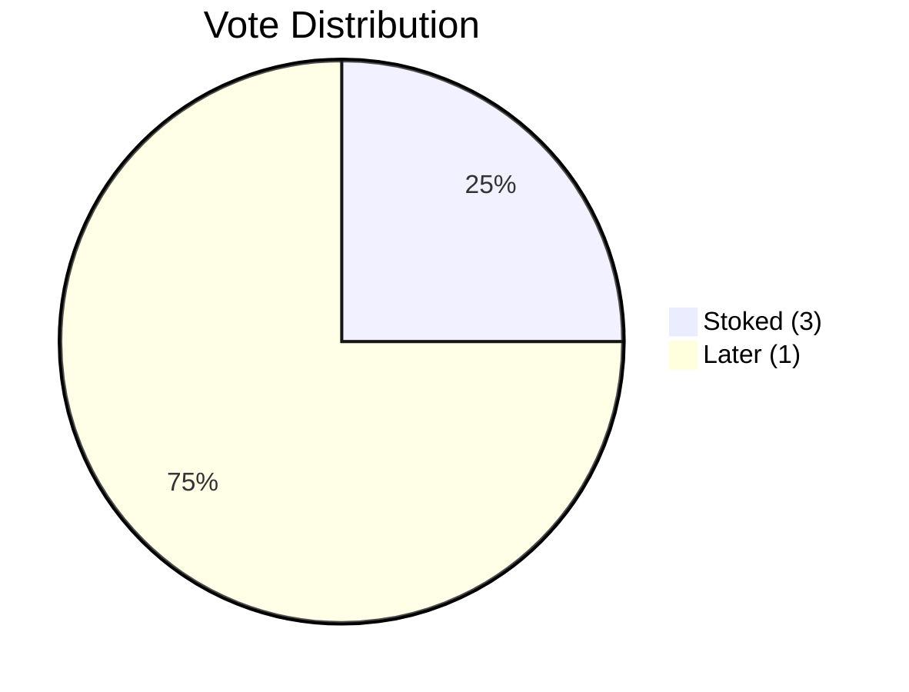
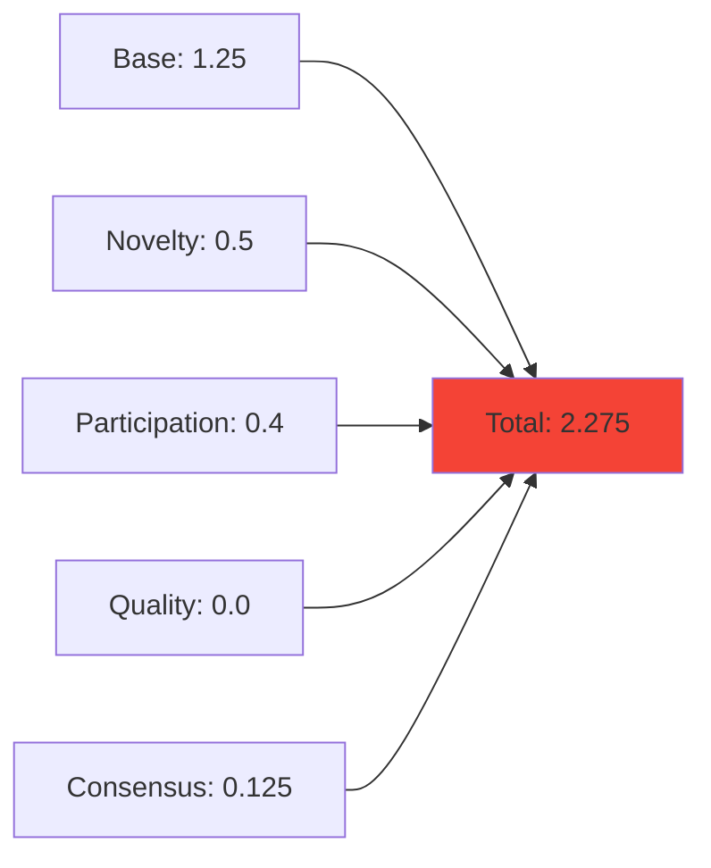
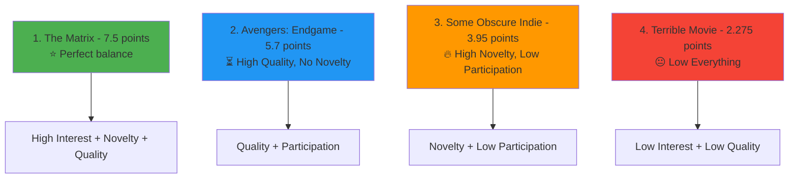

# Movie Appeal Formula Visualization

## Formula Overview

The movie appeal formula calculates a score from 0-9.5 points using five components:

```math
Final Appeal = Base Appeal + Novelty Bonus + Participation Bonus + Quality Bonus + Consensus Bonus
```

## Formula Components



## Component Details

### 1. Base Appeal (0-5.0 points)

**Formula**: `(avgInterest - 1.0) × 2.5`

- Based on average interest votes from people who haven't seen the movie
- Scale: 1=Later, 2=Interested, 3=Stoked
- Converts to 0-5.0 point scale

### 2. Novelty Bonus (0-1.0 points)

**Formula**: `(notSeenCount / totalVotes) × 1.0`

- Rewards movies that fewer people have seen
- Encourages shared new experiences
- Higher ratio = higher bonus

### 3. Participation Bonus (0-0.5 points)

**Formula**: `(totalVotes / uniqueVoters) × 0.5`

- Uses the `uniqueVoters` parameter
- Rewards movies with higher participation rates
- Prevents low-participation movies from dominating

### 4. Quality Bonus (0-2.0 points)

**Formula**: `(avgRating - 1.0) × 1.0`

- Only applies to movies people have seen
- Based on average rating votes
- Scale: 1=Meh, 2=Good, 3=Rewatch

### 5. Consensus Bonus (0-1.0 points)

**Formula**: `((highRatingRatio + highInterestRatio) × 0.5`

- Uses `highRatingCount` and `highInterestCount` parameters
- Rewards movies with strong group agreement
- High ratings OR high interest = bonus

## Sample Data Scenarios

### Scenario 1: "The Matrix" - High Interest, Some Seen



**Data:**

- Total Votes: 5
- Unique Voters: 5
- Seen: 2, Not Seen: 3
- Avg Interest: 2.6, Avg Rating: 3.0
- High Interest: 2, High Rating: 2

**Calculation:**



### Scenario 2: "Some Obscure Indie Film" - Low Interest, Nobody Seen



**Data:**

- Total Votes: 2
- Unique Voters: 5
- Seen: 0, Not Seen: 2
- Avg Interest: 2.0, Avg Rating: N/A
- High Interest: 1, High Rating: 0

**Calculation:**



### Scenario 3: "Avengers: Endgame" - High Interest, Everyone Seen



**Data:**

- Total Votes: 5
- Unique Voters: 5
- Seen: 5, Not Seen: 0
- Avg Interest: 2.2, Avg Rating: 2.8
- High Interest: 0, High Rating: 4

**Calculation:**



### Scenario 4: "Terrible Movie" - Low Interest, Some Seen



**Data:**

- Total Votes: 4
- Unique Voters: 5
- Seen: 2, Not Seen: 2
- Avg Interest: 1.5, Avg Rating: 1.0
- High Interest: 1, High Rating: 0

**Calculation:**



## Final Rankings



## Key Insights

1. **"The Matrix" wins** because it balances all factors well
2. **Novelty matters** - movies fewer people have seen get bonuses
3. **Quality counts** - movies people have seen and rated highly get points
4. **Participation matters** - movies with more votes get slight bonuses
5. **Consensus helps** - movies with strong agreement get bonuses

The formula successfully prioritizes movies that the group wants to watch together while encouraging shared new experiences!
