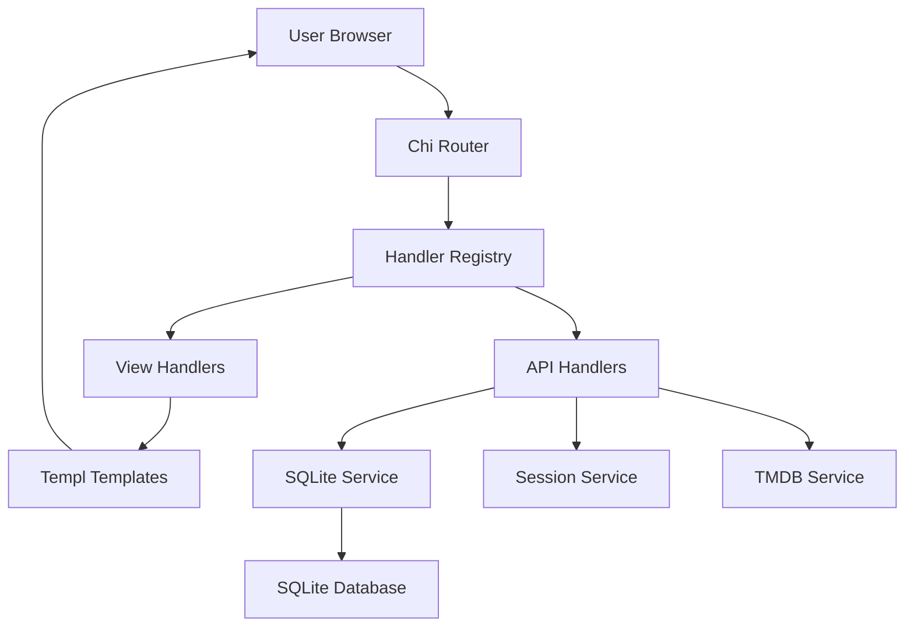

# Architecture Overview - Movie Poll System

## System Architecture

The Movie Poll system is built with a clean service-oriented architecture using Go, HTMX, Templ, and SQLite.

## Core Components

### 1. Handler Registry Pattern

- **Purpose**: Centralized HTTP handler management
- **Location**: `services/handlers.go`
- **Benefits**: Easy to add new handlers, clean separation of concerns

### 2. Service Layer

- **Router Service**: Chi-based HTTP routing (`services/router.go`)
- **Database Service**: SQLite operations (`services/sqlite.go`)
- **Session Service**: User session management (`services/session.go`)
- **TMDB Service**: External API integration (`services/tmdb_service.go`)
- **View Handlers**: Template rendering (`services/view_handlers.go`)

### 3. Type System

- **Shared Types**: Common data structures (`types/`)
- **Vote Types**: Vote and voting statistics (`types/vote.go`, `types/voting.go`)
- **Benefits**: Type safety, no circular imports

### 4. Template System

- **Templ**: Type-safe HTML generation (`views/*.templ`)
- **Generated Code**: Auto-generated Go files (`views/*_templ.go`)
- **Benefits**: Compile-time type checking, better performance

## Data Flow

### User Voting Flow

1. User visits `/` → `handleHome` → `renderMoviePollPage`
2. User votes → `handleVote` → `DB.SubmitVote` → Session update
3. Auto-advance to next movie or redirect to results

### Admin Flow

1. Admin visits `/admin` → `handleAdminLogin`
2. Admin dashboard → `handleAdminDashboard` → Statistics display
3. Database operations → API handlers → SQLite service

### API Flow

1. HTMX request → Chi router → Handler registry
2. Handler processes request → Service layer
3. Response → HTMX updates DOM

## Database Schema

### Tables

- **movies**: Movie information and metadata
- **votes**: User voting data with timestamps
- **admin_users**: Admin account management
- **appeals**: Calculated appeal scores

### Relationships

- `votes.movie_id` → `movies.id` (Foreign Key)
- `appeals.movie_id` → `movies.id` (Foreign Key)

## Security Features

### Session Management

- Secure session tokens
- Device-based tracking
- Session data encryption

### Admin Authentication

- Password hashing (bcrypt)
- Session-based admin login
- Protected admin routes

## Deployment

### Development

- Hot reload with Air
- Templ file generation
- CSS compilation with Tailwind

### Production

- Single binary deployment
- Railway platform
- Environment-based configuration

## CLI Tools

### Database Manager

- Standalone binary (`cmd/db-manager/`)
- Database statistics and management
- Bulk operations (clean, reset, delete)

### Makefile Commands

- Development workflow automation
- Build and deployment scripts
- Database management shortcuts

## Performance Considerations

### Caching

- Session data in memory
- Database connection pooling
- Static asset serving

### Scalability

- Stateless design
- Database connection management
- Service-oriented architecture

## Monitoring and Debugging

### Logging

- Structured logging system
- Debug endpoints
- Error tracking

### Admin Dashboard

- Real-time statistics
- Database management
- User activity monitoring
